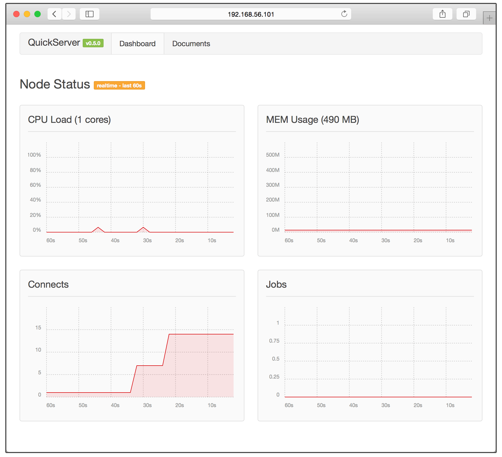

# 安装 Quick Server

Quick Server 安装和部署可以使用两种方式：

-   下载 Quick Server 源代码，并使用 shell 脚本进行安装，适合于在生产环境部署自己的 Quick Server 实例。
-   使用我们提供的虚拟机，直接测试 Quick Server 环境。适合测试和开发阶段。


## 使用 install.sh 脚本安装

首先，我们需要下载 Quick Server 代码。我们可以使用 Git 直接从 Quick Server 的代码仓库拉取。

```bash
$ git clone https://github.com/dualface/quickserver.git
$ cd quickserver
$ sudo ./install.sh
```

然后进入 Quick Server 所在目录，运行其中的 `install.sh` 脚本即可完成安装。

> 目前 `install.sh` 仅在 Ubuntu 和 CentOS 操作系统中进行了测试。

``install.sh`` 脚本支持一些参数:

-   `--prefix=arg`: 指定 Quick Server 的安装路径。默认路径是 ``/opt/quick_server`` 。
-   `-a, --all`: 安装 Quick Server 所有基本组件, 包括 nginx(OpenResty), Quick Server Framework, Redis, 以及 Beanstalkd。这是 ``install.sh`` 的默认选项。
-   `-n, --nginx`: 仅安装 nginx(OpenResty) 以及 Quick Server Framework。
-   `-r, --redis`: 仅安装 Redis。
-   `-b, --beanstalkd`: 仅安装 Beanstalkd。
-   `-h, --help`: 显示参数帮助。


## 使用虚拟机

要使用安装配置好 Quick Server 的 Ubuntu 虚拟机文件，需要首先安装 [VirtualBox](https://www.virtualbox.org/) 虚拟机软件。

-   下载 [VirtualBox](https://www.virtualbox.org/)
-   下载 [Quick Server 虚拟机](http://pan.baidu.com/s/1c0AjD7M)

1.  安装 VirtualBox 后，启动 VirtualBox，选择菜单“File -> Import Appliance”打开“Appliance to import”对话框。
2.  选中 `quickserver-vm.ova` 文件。
3.  在 `Appliance settings` 对话框中，选中“Reinitialize the Mac address of all network cards”选项。

    

4.  点击“Import”完成导入操作。
5.  虚拟机导入后，启动虚拟机即可看到下列画面：

    

    按照屏幕提示在浏览器中访问指定网址，即可看到 Quick Server 的监控界面：

    


## Quick Server 的启动

Quick Server 的启动，停止以及进程状态查看是通过 `start_quick_server.sh`，`stop_quick_server.sh` 以及 `status_quick_server.sh` 完成的。


### start_quick_server.sh 脚本

`start_quick_server.sh` 脚本支持如下的参数：

-   `--debug`: 以调试模式启动 Quick Server。
-   `-a, --all`: 启动 Quick Server 所有基本组件, 包括 nginx(OpenResty), Quick Server Framework, Redis, 以及 Beanstalkd。这是 `start_quick_server.sh` 的默认选项。
-   `-n, --nginx`: 仅启动 nginx(OpenResty) 以及 Quick Server Framework。
-   `-r, --redis`: 仅启动 Redis。
-   `-b, --beanstalkd`: 仅启动 Beanstalkd。
-   `-h, --help`: 显示参数帮助。

我们可以执行这个脚本来启动 Quick Server。

```bash
$ sudo ./start_quick_server.sh
```

如果要以调试模式来启动 Quick Server，可以这样：

```bash
$ sudo ./start_quick_server.sh --debug
```


### stop_quick_server.sh 脚本

``stop_quick_server.sh`` 脚本支持如下的参数：

-   `--reload`: 向 nginx 进程发送 SIGHUP 信号，用于重新载入配置，重启 nginx 的 worker 进程。该选项仅在 ``-n`` 或者 ``--nginx`` 被指定时有效。
-   `-a, --all`: 停止 Quick Server 所有基本组件, 包括 nginx(OpenResty), Quick Server Framework, Redis, 以及 Beanstalkd。这是 ``stop_quick_server.sh`` 的默认选项。
-   `-n, --nginx`: 仅停止 nginx(OpenResty) 以及 Quick Server Framework。
-   `-r, --redis`: 仅停止 Redis。
-   `-b, --beanstalkd`: 仅停止 Beanstalkd。
-   `-h, --help`: 显示参数帮助。

我们可以执行这个脚本来停止 Quick Server。

```bash
$ sudo ./stop_quick_server.sh
```

如果要 nginx 重新载入 nginx 的配置，并重启 nginx 的 worker 进程，可以这样使用：

```bash
$ sudo ./stop_quick_server.sh -n --reload
```

> 值得注意的是， ``--reload`` 并不是重新载入 ``config.lua`` ，而仅仅是重新载入 nginx 的配置文件 ``nginx.conf`` ，并重启所有的 nginx worker 进程，nginx master 并不会重启。


### status_quick_server.sh 脚本

`status_quick_server.sh` 脚本用于查看与 Quick Server 相关的进程。直接使用它就可以了：

```bash
$ sudo ./status_quick_server.sh
```

终端会将结果以多个 section 的方式返回，包括 `[Nginx]` ， `[Redis]` ， `[Beanstalkd]` 以及 `[Monitor]` 。每一个 section 下包含了各自相关的进程。

> 要是以默认的 `-a` 或者 `--all` 方式启动 Quick Server，那么所有的 section 下都应该看到有进程在运行。如果以其他选项启动了 Quick Server 的部分组件，那么只会看到部分组件的进程在运行，并且 `[Monitor]` 下不会有进程运行，也就是在这种情况下， Monitor 不会启动。

